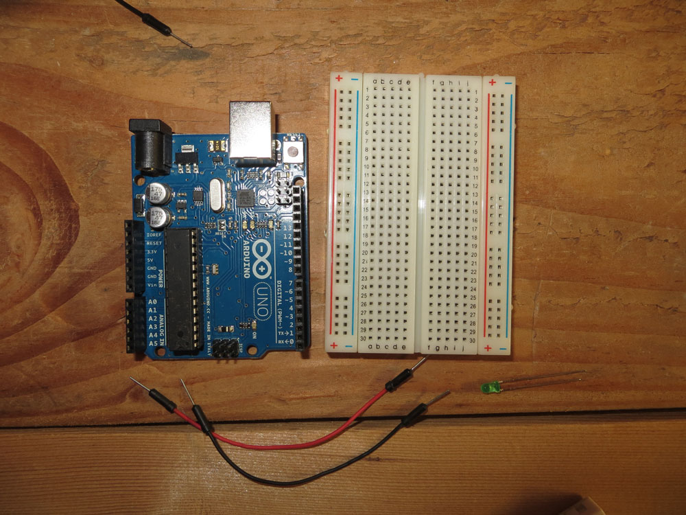
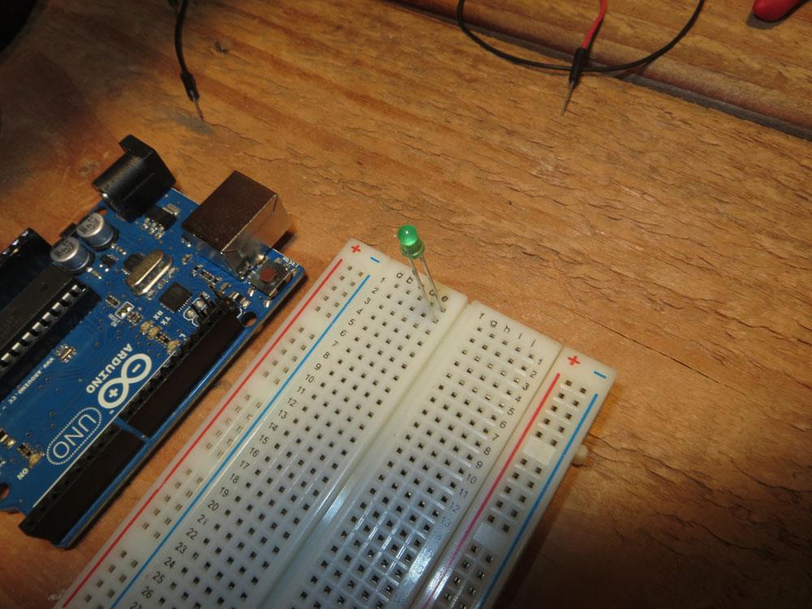
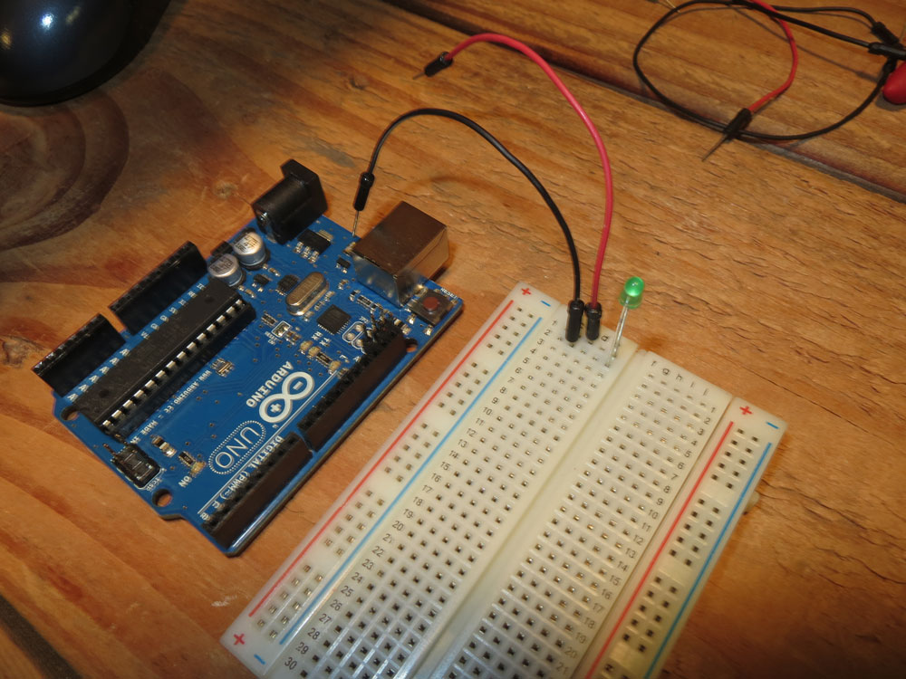
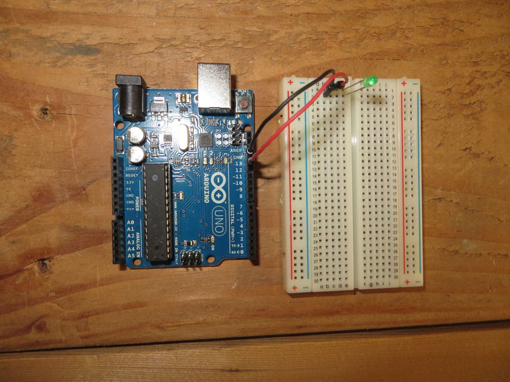
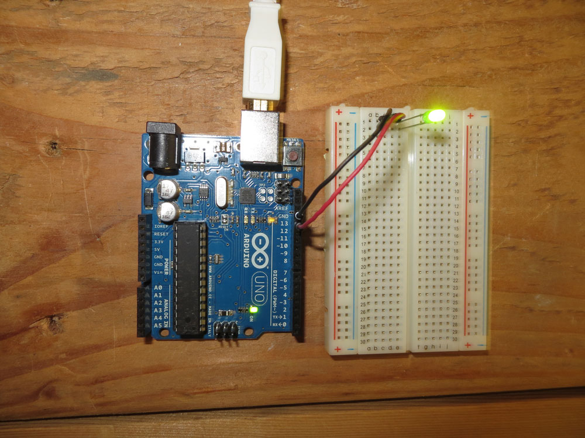
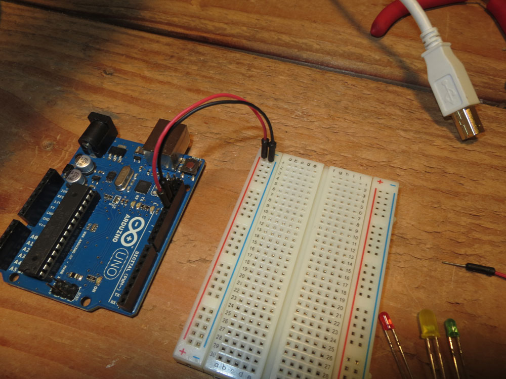
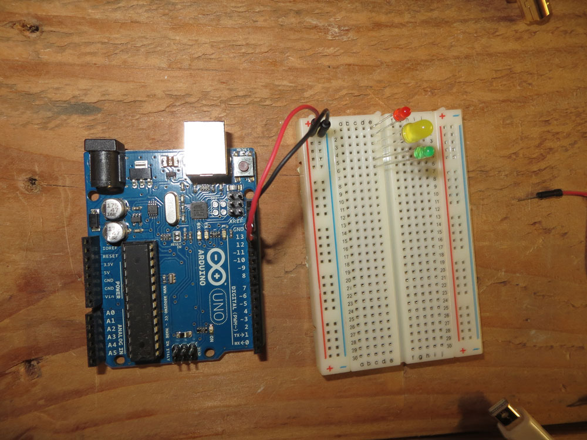
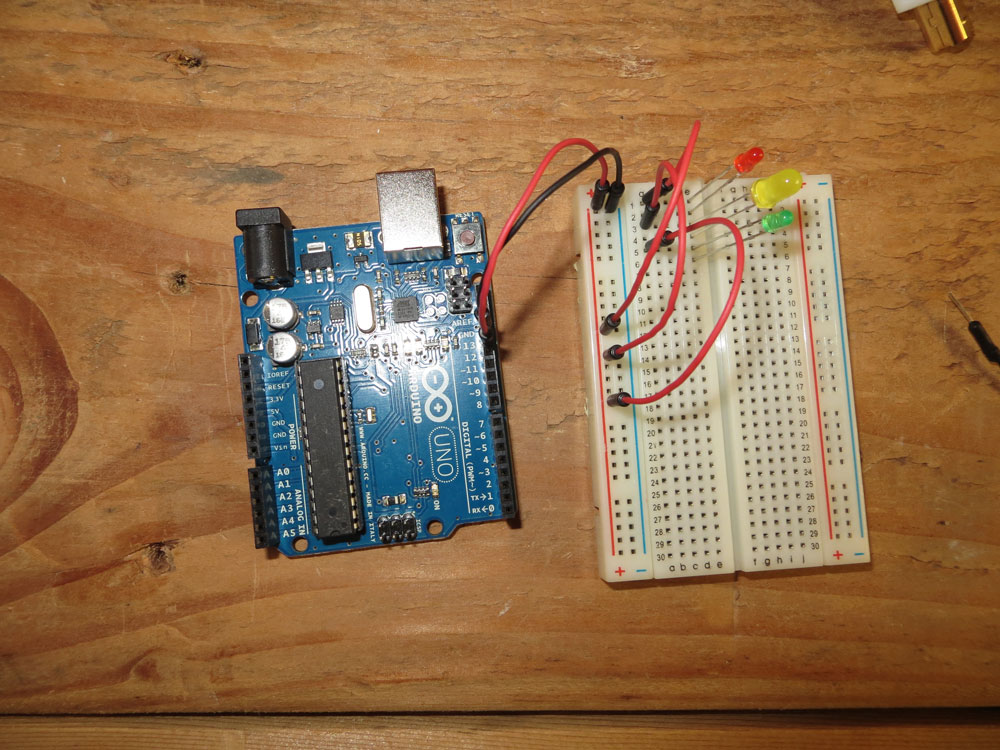
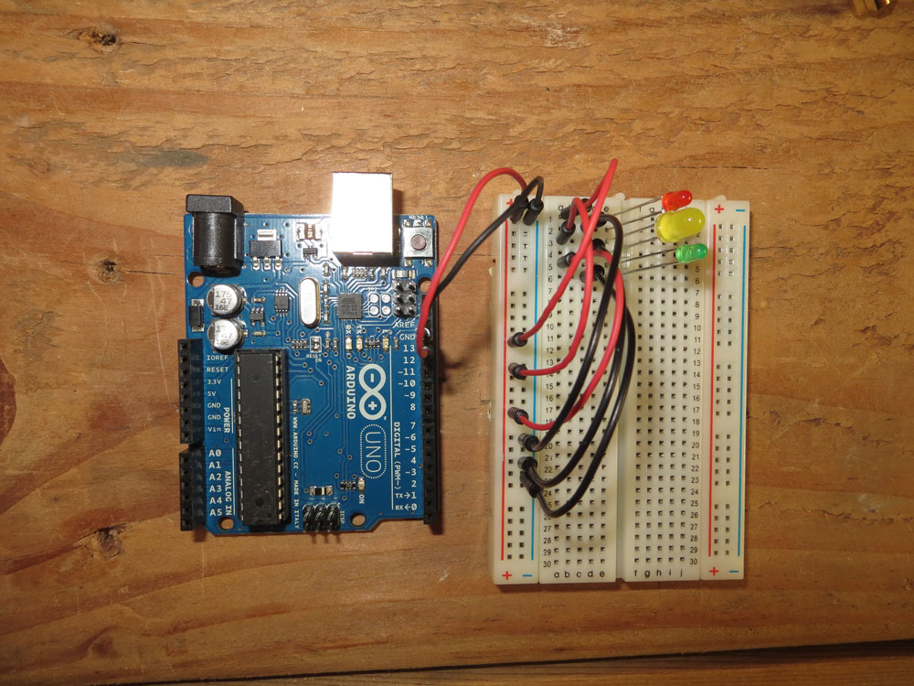
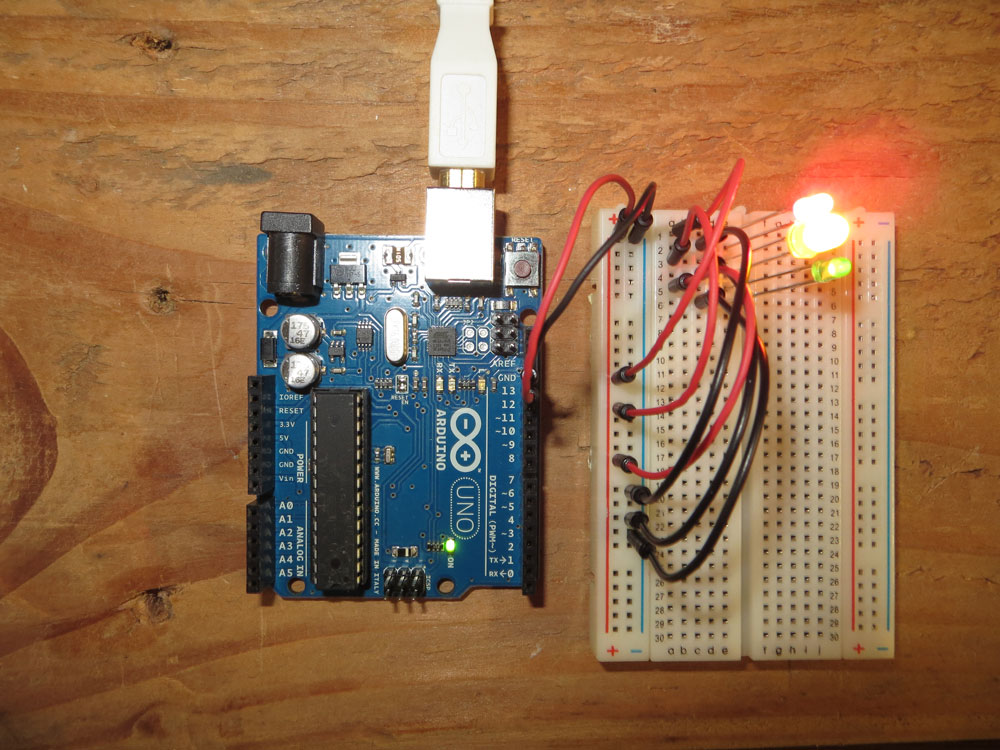

# Blinking a light

### The Hello World of Electronics

One of the simplest things you can do with electronics is to make an LED blink on and off. 


## Arduino

Blinking a light on a Arduino could not be any simpler. 

1. Plug in the board to your USB board. 
2. Boot up the Arduino IDE
3. Either copy this code to a blank sketch and save it or go to File > Examples > 01.Basics > Blink
4. Click upload (the arrow pointed to the right). 
5. Marvel at the small LED on the board blinking every second. 

The code: 

```
*/
  Blink
  Turns on an LED on for one second, then off for one second, repeatedly.
 
  This example code is in the public domain.
 */
 
// Pin 13 has an LED connected on most Arduino boards.
// give it a name:

int led = 13;

// the setup routine runs once when you press reset:

void setup() {                
  // initialize the digital pin as an output.
  pinMode(led, OUTPUT);
}

// the loop routine runs over and over again forever:
void loop() {
  digitalWrite(led, HIGH);   // turn the LED on (HIGH is the voltage level)
  delay(1000);               // wait for a second
  digitalWrite(led, LOW);    // turn the LED off by making the voltage LOW
  delay(1000);               // wait for a second   
             // wait for a second   
}

```

### Taking it further###

**How would you use an external LED instead of the internal?**

That LED is awfully tiny, and kind of an industrial orange. So let's use our own LED and walk through the basics of a circuit while we're at it. 

We need a breadboard, so grab yours. Place it to the right of the Arduino. To do this, we'll also need a red and black jumper wire and an LED.



Let's take a look at the LED. It's a very simple device that emits light. You'll notice one wire is longer than the other -- that's the positive, or anode, wire. The shorter one is the negative, or cathode, wire. 

**STEP 1**  

Take the anode wire -- the longer one -- and put it into our breadboard in column e row 1. The cathode wire will go into column e row 2. 



**STEP 2**

Take a black jumper wire and plug it into anywhere in row 2 to the left of column e.

**STEP 3**

Take a red jumper wire and plug it into anywhere in row 1 to the left of column e. 



**STEP 4**

Plug the red jumper wire into digital pin 13 or the highest digital pin you have on your board. You'll know it's a digital pin if there isn't an A in front of it (A pins are analog). 

**STEP 5**

Plug the black jumper wire into a GND pin. On many Ardunio boards, there's one immediately above the digital 13 pin. 



**STEP 6**

Plug your Arduino board into your USB port, open the Arduino IDE if you don't already have it open. The blink sketch you used before should work. If it was the last thing you ran on the board, your LED should start blinking. 



**WHY DID THAT WORK?**

That worked because the LED built into the board is on the same pin as digital 13. Our blink sketch just said turn pin 13 on for a second, and then turn it off for a second. It didn't care what was on pin 13. So we just tapped into it. But let's take a closer look here. 

If we look at our blink sketch, the first bit of code you see is this

```int led = 13;```

What that does is create a variable called "led" that is associated with the integer 13. Do we absolutely have to do this? No. We could just tell it what pin we want later. This is just helpful to keep track of things. 

Every sketch has two main parts: A setup and a loop. Let's look at the setup. 

```
void setup() {                
  pinMode(led, OUTPUT);
}
```

This just very simply tells the board that pin 13 (see our led variable there?) will be set to output, instead of input. 

In any sketch, the loop is where most of the work is getting done. It works like any other programming loop -- you can interrupt them, break out of them, or let them run on forever. 

```
void loop() {
  digitalWrite(led, HIGH);  
  delay(1000); 
  digitalWrite(led, LOW);
  delay(1000);
  }
```

You can pretty much see what this does: Send output (electricity) to our led. Then wait for 1000 milliseconds, or one second. Then, turn off that electricity to the led and wait another second. Then, repeat it. Forever.

If the slow blink doesn't thrill you, change the delay time. If you set it for 10 milliseconds, it will blink so fast you can't easily see it. Change the values and hit upload. 

### Stretch goal: More than one LED###

**How could you make multiple LEDs blink at the same time?**

Now that we know how to make a light blink, what if we wanted to make a lot of lights blink? All we have to do is get power to them to turn on and off regularly. Easy, right? 

It is. 

**STEP 1**  

For this, we're going to run power into the power channels on your breadboard. So take a black jumper wire and plug it in to the negative channel on your breadboard, and a red jumper wire into to the postive channel on the breadboard.

**STEP 2**

Plug the red jumper wire into digital pin 13 and the black jumper wire into the GND pin. 



**STEP 3** 

Plug three LEDs into column e, with anode (long) pins in rows 1, 3 and 5. 




**STEP 4** 

Plug red jumper wires into rows 1, 3 and 5 -- your anode rows -- and connect them to the postive channel on the breadboard. It doesn't matter where in the positive channel you plug them in -- they're all the same. 



**STEP 5**

Plug black jumper wires into rows 2, 4 and 6 -- your cathode rows -- and connect them to the negative channel on your breadboard. It doesn't matter where in the negative channel you plug them in -- they're all the same. 



**STEP 6**

Plug your Arduino board into your USB port, open the Arduino IDE if you don't already have it open. The blink sketch you used before should work. If it was the last thing you ran on the board, your LEDs should start blinking. 



**WHY DID THAT WORK?**

Simply put, we used the power channel for what it's for -- to run power through it. Normally, you'd just run power into it, not blink it on and off, but for our purposes, it worked. Each light was tapped into the same power channel, so you could pull one out and the others would still work. 

If we wanted to make each light blink independently, we would just have to put each light on a different pin, and our code would repeat for as many times as we had LEDs. We'd set up each LED pin we used, and in our loop block, we would change the LED variable to match which LED we were blinking. 

That code would look like this:

```
int led1 = 13;
int led2 = 12;
int led3 = 11;

void setup() {
  pinMode(led1, OUTPUT);
  pinMode(led2, OUTPUT);
  pinMode(led3, OUTPUT);  
}

void loop() {
  digitalWrite(led1, HIGH);   
  delay(1000);
  digitalWrite(led1, LOW);
  delay(1000);
  digitalWrite(led2, HIGH);   
  delay(1000);
  digitalWrite(led2, LOW);
  delay(1000);
  digitalWrite(led3, HIGH);   
  delay(1000);
  digitalWrite(led3, LOW);
  delay(1000);
}

```

###What did we learn?###

* How to upload a sketch to an Arduino board.
* What the parts of an LED are.
* How to connect a breadboard to an Arduino.
* How to create a simple curcuit with an LED.
* How to create a more involved, but no less simple, circuit with multiple LEDs. 
