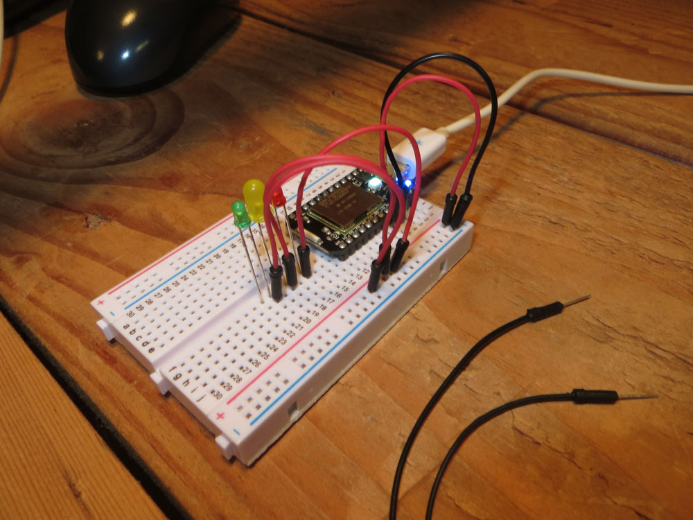

# Blinking a light

### The Hello World of Electronics

One of the simplest things you can do with electronics is to make an LED blink on and off. 

## Particle Core/Electron

Blinking a light on a Particle Core or Electron could not be any simpler. 

1. Plug in the board to your USB board. 
2. Boot up the [Particle IDE](https://build.particle.io/build/) (see Basics about claiming your Particle board and connecting it to the IDE).
3. Copy this code into a blank sketch
4. Click the lightning bolt (flash) and send the code to the board. 

The code: 

```
int led = D7;

void setup() {
  pinMode(led, OUTPUT);
}

void loop() {
  digitalWrite(led, HIGH);   
  delay(1000);
  digitalWrite(led, LOW);
  delay(1000);
}

```

### Taking it further###

**How would you use an external LED instead of the internal?**

That LED is awfully tiny, and kind of a pale blue. So let's use our own LED and walk through the basics of a circuit while we're at it. 

We need a breadboard, so grab yours. Press the pins of your Particle board into the breadboard -- it doesn't matter where, so long as the board straddles the center channel. The best thing to do would be to put the micro USB hub -- the power -- to the top of the board and put the pins in starting at row 1 of the breadboard. That will give you more room to work below. For this exercise, we'll also need a red and black jumper wire and an LED.


Let's take a look at the LED. It's a very simple device that emits light. You'll notice one wire is longer than the other -- that's the positive, or anode, wire. The shorter one is the negative, or cathode, wire. 

**STEP .5: The super super super simple way**  

Take the anode wire -- the longer one -- and put it into our breadboard in the row next to pin D7. The cathode wire will go into the row next go the GND pin. On my board, that's anode in row 5, cathode in row 4 both in column i. If you flash the blink code from above, your LED will blink every second. 


**STEP 1: The slightly harder way**

Remove the LED if you did STEP .5. Take a red jumper wire and plug it into the row next to pin D7. Take a black jumper wire and plug it into the row next to GND. 

**STEP 2**

Plug your LED into a row lower on the breadboard. For this example, I put the LED into column f, with anode in row 18 and cathode in row 19. 

**STEP 3**

Plug the red jumper wire into your LED's anode row (row 18 for me) and the black into the LED's cathode row (row 19 for me). 


**STEP 4**

If you didn't unplug the Particle board from STEP .5, your LED should just light up and start blinking. If not, flash the blink code from above and it will start blinking every second. 

**WHY DID THAT WORK?**

That worked because the LED built into the board is on the same pin as digital 7 (D7). Our blink sketch just said turn pin 7 on for a second, and then turn it off for a second. It didn't care what was on pin 7. So we just tapped into it. But let's take a closer look here. 

If we look at our blink sketch, the first bit of code you see is this

```int led = D7;```

What that does is create a variable called "led" that is associated with the D7 pin. Do we absolutely have to do this? No. We could just tell it what pin we want later. This is just helpful to keep track of things. 

Every sketch has two main parts: A setup and a loop. Let's look at the setup. 

```
void setup() {                
  pinMode(led, OUTPUT);
}
```

This just very simply tells the board that pin D7 (see our led variable there?) will be set to output, instead of input. 

In any sketch, the loop is where most of the work is getting done. It works like any other programming loop -- you can interrupt them, break out of them, or let them run on forever. 

```
void loop() {
  digitalWrite(led, HIGH);  
  delay(1000); 
  digitalWrite(led, LOW);
  delay(1000);
  }
```

You can pretty much see what this does: Send output (electricity) to our led. Then wait for 1000 milliseconds, or one second. Then, turn off that electricity to the led and wait another second. Then, repeat it. Forever.

If the slow blink doesn't thrill you, change the delay time. If you set it for 10 milliseconds, it will blink so fast you can't easily see it. Change the values and hit upload. 

### Stretch goal: More than one LED###

**How could you make multiple LEDs blink at the same time?**

Now that we know how to make a light blink, what if we wanted to make a lot of lights blink? All we have to do is get power to them to turn on and off regularly. Easy, right? 

It is. 

**STEP 1**  

For this, we're going to run power into the power channels on your breadboard. So take a black jumper wire and plug it in to the negative channel on your breadboard, and a red jumper wire into to the postive channel on the breadboard.

**STEP 2**

Plug the red jumper wire into digital pin D7 and the black jumper wire into the GND pin. 


**STEP 3** 

Plug three LEDs into column f, with anode (long) pins in rows 16, 18 and 20. Cathode wires will go into 17, 19 and 21. 


**STEP 4** 

Plug red jumper wires into rows 16, 18 and 20 -- your anode rows -- and connect them to the postive channel on the breadboard. It doesn't matter where in the positive channel you plug them in -- they're all the same. 



**STEP 5**

Plug black jumper wires into rows 17, 19 and 21 -- your cathode rows -- and connect them to the negative channel on your breadboard. It doesn't matter where in the negative channel you plug them in -- they're all the same. 


**STEP 6**

Plug your Particle board into your USB port. If the blink sketch from above was the last thing you ran, your LEDs should start blinking. If not, open the IDE and flash the same blink sketch from above. 


**WHY DID THAT WORK?**

Simply put, we used the power channel for what it's for -- to run power through it. Normally, you'd just run power into it, not blink it on and off, but for our purposes, it worked. Each light was tapped into the same power channel, so you could pull one out and the others would still work. 

If we wanted to make each light blink independently, we would just have to put each light on a different pin, and our code would repeat for as many times as we had LEDs. We'd set up each LED pin we used, and in our loop block, we would change the LED variable to match which LED we were blinking. 

That code would look like this:

```
int led1 = D7;
int led2 = D6;
int led3 = D5;

void setup() {
  pinMode(led1, OUTPUT);
  pinMode(led2, OUTPUT);
  pinMode(led3, OUTPUT);  
}

void loop() {
  digitalWrite(led1, HIGH);   
  delay(1000);
  digitalWrite(led1, LOW);
  delay(1000);
  digitalWrite(led2, HIGH);   
  delay(1000);
  digitalWrite(led2, LOW);
  delay(1000);
  digitalWrite(led3, HIGH);   
  delay(1000);
  digitalWrite(led3, LOW);
  delay(1000);
}

```

###What did we learn?###

* How to upload a sketch to a Particle board.
* What the parts of an LED are.
* How to connect a breadboard to a Particle board.
* How to create a simple curcuit with an LED.
* How to create a more involved, but no less simple, circuit with multiple LEDs. 
