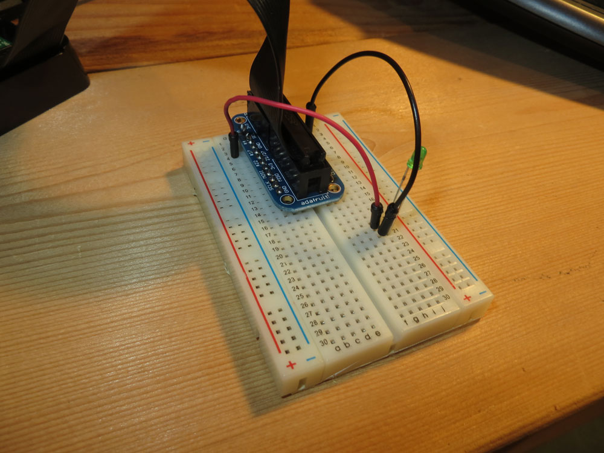

# Blinking a light

### The Hello World of Electronics

One of the simplest things you can do with electronics is to make an LED blink on and off. 

## Raspberry Pi

If you're familiar with the Arduino and Arduino compatible boards, the Raspberry Pi is an entirely different animal. They often get lumped together because of their popularity with tinkerers, but they're apples and oranges. An Arduino is a microcontroller -- a very simple chip. A Raspberry Pi is a complete computer. You need a mouse and a keyboard and a monitor to use it. You run programs on it. 

Where the come closer together is the GPIO pins that the Pi has. GPIO stands for General Purpose Input and Output, and they're similar to the pins on the Arduino. 

And, you guessed it, we can make a light blink with them. But it's not *quite* as easy as it is on the Arduino. 

For this, you're going to need a RasPi with Raspbian or some other operating system on it. You'll need it to be up and running. You'll need to have installed the RPi.GPIO library and you'll need your Pi connected to a breadboard via a Pi Cobbler or Pi Wedge. 

**STEP 1**

Press the Pi Cobbler/Wedge into the breadboard, preferrably near the top of the board to give you the most space at the bottom. 


**STEP 2**

Put the LED into the breadboard. It doesn't matter where, so long as the anode wire is in one row and the cathode wire is in another row. For my example, I put the anode wire into column j row 20 and the cathode wire into row 21. 


**STEP 3**

Put a black jumper wire into a row next to one of the GND pins. There are several. Any will do. Then plug the other end of the black jumper wire into your cathode row. If you are following my example, it would go into row 21. 


**STEP 4**

For the red jumper wire, it helps to understand that not all pins on the Raspberry Pi are programmable. We need a 3.3v pin, but pin #1 -- the first pin on the top left side -- is not programmable. Pin #7 -- the fourth down on the left side -- is programmable. Pins are counted first on the left is 1, first on the right is 2, second on the left is 3 and so on. So put the red jumper wire in the row next to pin 7, the fourth down on the left. Then put the other end into your anode row. In my example, that's row 20. 



**STEP 5**

Now we need to write some python. How you choose to do this is up to you. You can use IDLE, which comes installed on Raspbian. I find it's easiest to just use the command line. So pull up a terminal window and enter this series of commands:

```
touch blink.py

nano blink.py
```
That will create a file called blink.py and then open a text editor editing blink.py. The code we need to make our light blink is:

```
import RPi.GPIO as GPIO
import time

GPIO.setmode(GPIO.BOARD)
GPIO.setup(7, GPIO.OUT)

for x in range(0,10):
    GPIO.output(7, True)
    time.sleep(1)
    GPIO.output(7, False)
    time.sleep(1)
    
GPIO.cleanup()
```

To save the file, hit control o to save it and then control x to exit out. Then, you'll run this command:

`sudo python blink.py`

Sudo stands for superuser do, which gives you the proper permissions to access the GPIO pins on the board. You should see your light blink 10 times. 

**WHY DID THAT WORK?**

Let's look at the code. 

In Python, the first things we do are import any libraries we need. In this case, we need the GPIO library and a library called time. That time library allows us to stop things for a period of time, among other things. 

```
import RPi.GPIO as GPIO
import time
```

Next we set things up:

```
GPIO.setmode(GPIO.BOARD)
GPIO.setup(7, GPIO.OUT)
```

The first line sets up how the libary will number the pins on the board (there's another method, which is more specialized, that we won't use). The second line sets up pin 7 to be an output pin (versus input). 

Now, we loop some code. We'll parse this out.

```
for x in range(0,10):
    GPIO.output(7, True)
    time.sleep(1)
    GPIO.output(7, False)
    time.sleep(1)
```

The first line just sets up the loop. In this case, it sets up a loop that will run from a range of numbers. So for every x in a range from 0,10, do the following things is what that says. We can change the 10 to be whatever we want -- 1, 37, 1000 -- and that's how many times the light will blink. We could set this up to run infintely, but I couldn't think of why you'd want to do that. 

The next few lines speak for themselves. Set the output of pin 7 to True -- meaning turn it on -- then go to sleep for one second. Then turn it off -- set it to False -- and then go to sleep for a second. Once it completes those four lines, it goes back up and does it again until it reaches the number of times our range tells it to do it. 

The last line -- `GPIO.cleanup()` -- just returns any resources used to the RasPi and clears the pins for their next use. It's just good practice to call that when you're done. 

### Stretch goal: More than one LED###

**How could you make multiple LEDs blink at the same time?**

Now that we know how to make a light blink, what if we wanted to make a lot of lights blink? All we have to do is get power to them to turn on and off regularly. Easy, right? 

It is. 

**STEP 1**  

For this, we're going to run power into the power channels on your breadboard. So take a black jumper wire and plug it in to the negative channel on your breadboard, and a red jumper wire into to the postive channel on the breadboard.

**STEP 2**

Plug the red jumper wire into pin 7 and the black jumper wire into the GND pin. Pins are counted first on the left is 1, first on the right is 2, second on the left is 3 and so on. So put the red jumper wire in the row next to pin 7, the fourth down on the left. There are multiple ground pins. It doesn't matter which one you use. 


**STEP 3** 

Plug three LEDs into column j, with anode (long) pins in rows 20, 22 and 24. Cathode wires will go into 21, 23 and 25. 


**STEP 4** 

Plug red jumper wires into rows 16, 18 and 20 -- your anode rows -- and connect them to the postive channel on the breadboard. It doesn't matter where in the positive channel you plug them in -- they're all the same. 

**STEP 5**

Plug black jumper wires into rows 17, 19 and 21 -- your cathode rows -- and connect them to the negative channel on your breadboard. It doesn't matter where in the negative channel you plug them in -- they're all the same. 


**STEP 6**

From your terminal, run `sudo python blink.py` and you should see all of your LEDs blink 10 times. 

**WHY DID THAT WORK?**

Simply put, we used the power channel for what it's for -- to run power through it. Normally, you'd just run power into it, not blink it on and off, but for our purposes, it worked. Each light was tapped into the same power channel, so you could pull one out and the others would still work. 

If we wanted to make each light blink independently, we would just have to put each light on a different pin, and our code would repeat for as many times as we had LEDs. We'd set up each LED pin we used, and in our loop block, we would change the LED variable to match which LED we were blinking.


 