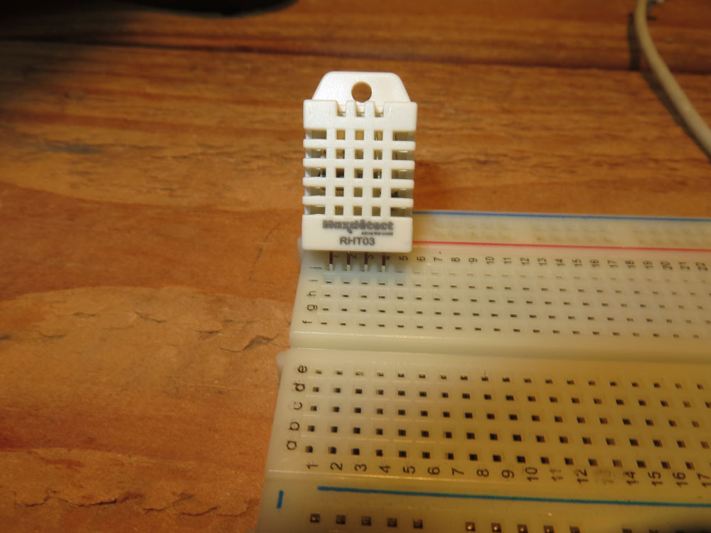
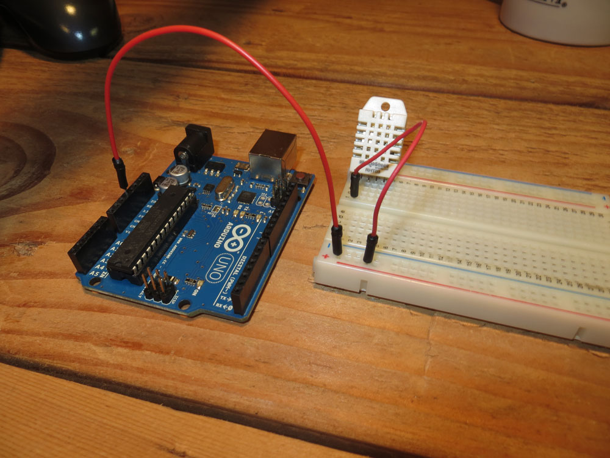
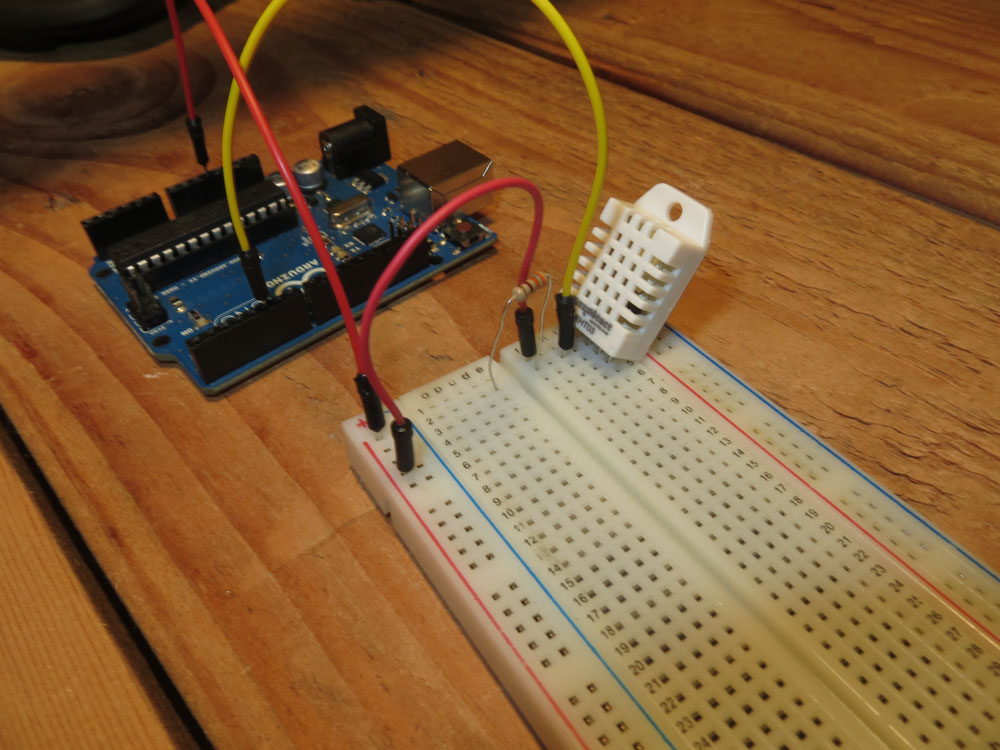
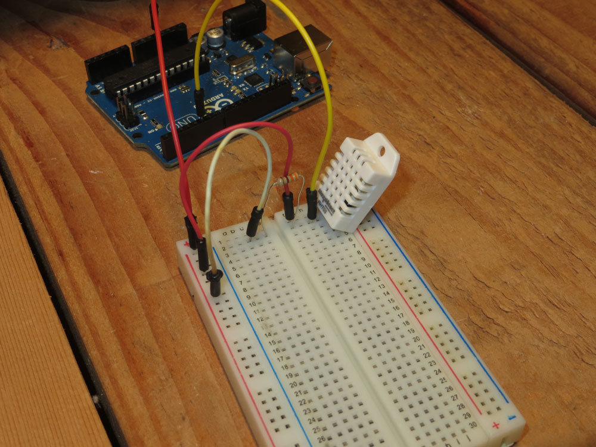
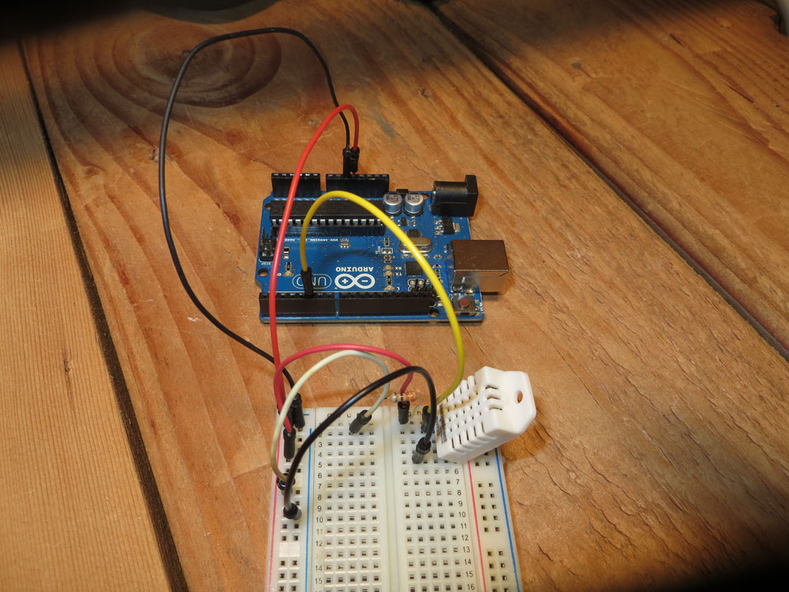

# Checking the temperature

### Our first foray into inputs

The most basic and widespread sensor journalism in the world is the weather. And that starts with temperature. So given that, let's explore taking the temperature of the room you are in right now. 

## Arduino

To do this, we'll need to try a few new things. We'll first need to regulate the signal using a resistor -- and explore the concept of "noisy" signals. We'll need to take input -- instead of providing output -- to our board. And we'll need to use the monitor built into the Arduino software to see what the temperature is. 

We need a breadboard, so grab yours. Place it to the right of the Arduino. To do this, we'll also need a 1KOhm resistor, red jumper wire, two black jumper wires, a long red jumper wire, a long black jumper wire, a jumper wire of another color and an RHT03 temperature and humidity sensor.


**STEP 1** 

Face the waffle-ly side of RHT03 toward you. Place RHT03 into the breadboard in column j or the furthest right column, with the four pins arrayed with the left most pin on the sensor in row 1, second pin in row 2 and so on. 




**STEP 2** 

Take a short red jumper wire and plug it into row 1 near the sensor. Plug the other wire into the positive channel.

**STEP 3**

Take the longer red jumper wire and plug one end into the positive channel, the other into the 5V pin on the Arduino board.



**STEP 4**

Take a long jumper wire of another color other than black or red (I used yellow for contrast) and plug it into row 2, in a pin near to the sensor. Plug the other end of the jumper into Pin 5 on the Arduino. 

**STEP 5**

Put one end of a 1KOhm resistor into row 2, nearest the center gap between the two sides of the breadboard. Then, put the other side of the resistor into row 2 on the other side of the center divide, creating a sort of bridge. 




**STEP 6**

Place one end of a short jumper wire into the left side of the breadboard in row 2 (my resistor is in column e, my wire is in column c), and then plug the other end into the positive channel. 



**STEP 7**

Pin 3 is blank. We do nothing with it.

**STEP 8**

Pin 4 is the ground. Take a short black jumper wire and plug it into the broadboard closest to the sensor in row 4. Plug the other end of the jumper into the negative channel.

**STEP 9**

Take a long black jumper wire and plug it into the negative channel. Plug the other end into a GND pin on the Arduino board. 




**STEP 10**

Open the Arduino IDE. To use this sensor, we're going to need to install an external library. To do that, follow these instructions: [http://arduino.cc/en/Guide/Libraries](http://arduino.cc/en/Guide/Libraries)

The library we need is here: [https://github.com/RobTillaart/Arduino](https://github.com/RobTillaart/Arduino)

**STEP 11** 

Upload this code:

```
#include <dht.h>

dht DHT;


#define DHT22_PIN 5

void setup()
{
    Serial.begin(9600);
    Serial.println("DHT TEST PROGRAM ");
    Serial.print("LIBRARY VERSION: ");
    Serial.println(DHT_LIB_VERSION);
    Serial.println();
    Serial.println("Type,\tstatus,\tHumidity (%),\tTemperature (C)");
}

void loop()
{
    // READ DATA
    Serial.print("DHT22, \t");
    int chk = DHT.read22(DHT22_PIN);
    switch (chk)
    {
        case DHTLIB_OK: 
            Serial.print("OK,\t"); 
            break;
        case DHTLIB_ERROR_CHECKSUM: 
            Serial.print("Checksum error,\t"); 
            break;
        case DHTLIB_ERROR_TIMEOUT: 
            Serial.print("Time out error,\t"); 
            break;
        default: 
            Serial.print("Unknown error,\t"); 
            break;
    }
    // DISPLAY DATA
    Serial.print(DHT.humidity, 1);
    Serial.print(",\t");
    Serial.println(DHT.temperature, 1);

    delay(1000);

}
```

If all has worked well, you should see the following:

```
DHT TEST PROGRAM 
LIBRARY VERSION: 0.1.21

Type,	status,	Humidity (%),	Temperature (C)
DHT22, 	OK,	37.3,	20.9
DHT22, 	OK,	37.3,	20.9
```

For you Americans, 20.9 C is about 69 F. My workshop is cold!

**WHY DID THAT WORK**


##STRETCH GOAL: CONVERT TO FAHRENHEIT##

Arduino pulls temperature data in degrees celsius with ```DHT.temperature```. You can do math on ```DHT.temperature```. The formula for celsius to fahrenheit conversion on temperatures above 0º is ```(degreeCelsius*1.8)+32```. Store that math in a variable by declaring ```float variableName = math;```. Print your variable by copying the syntax used for celsius: ```Serial.println(variable, 1);```.  

```
#include <dht.h>

dht DHT;


#define DHT22_PIN 5

void setup()
{
    Serial.begin(9600);
    Serial.println("DHT TEST PROGRAM ");
    Serial.print("LIBRARY VERSION: ");
    Serial.println(DHT_LIB_VERSION);
    Serial.println();
    Serial.println("Type,\tstatus,\tHumidity (%), \tTemperature (C),\tTemperature (F)");
}

void loop()
{
    // READ DATA
    Serial.print("DHT22, \t");
    int chk = DHT.read22(DHT22_PIN);
    switch (chk)
    {
        case DHTLIB_OK: 
            Serial.print("OK,\t"); 
            break;
        case DHTLIB_ERROR_CHECKSUM: 
            Serial.print("Checksum error,\t"); 
            break;
        case DHTLIB_ERROR_TIMEOUT: 
            Serial.print("Time out error,\t"); 
            break;
        default: 
            Serial.print("Unknown error,\t"); 
            break;
    }

    float f = (DHT.temperature*1.8)+32;
    
    // DISPLAY DATA
    Serial.print(DHT.humidity, 1);
    Serial.print(",\t");
    Serial.println(f, 1);
    Serial.println(DHT.temperature, 1);

    delay(1000);

}
```