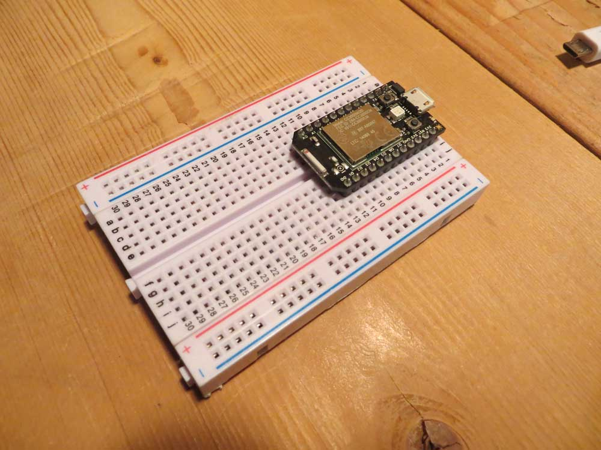
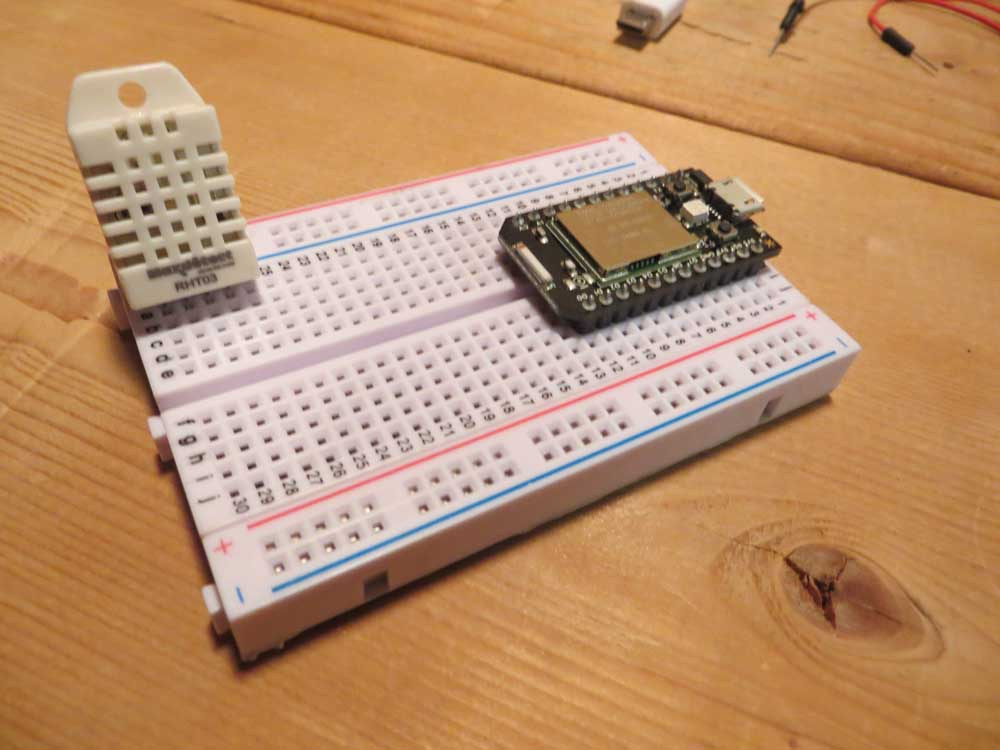
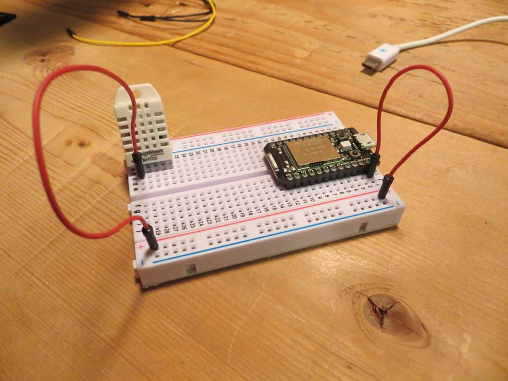
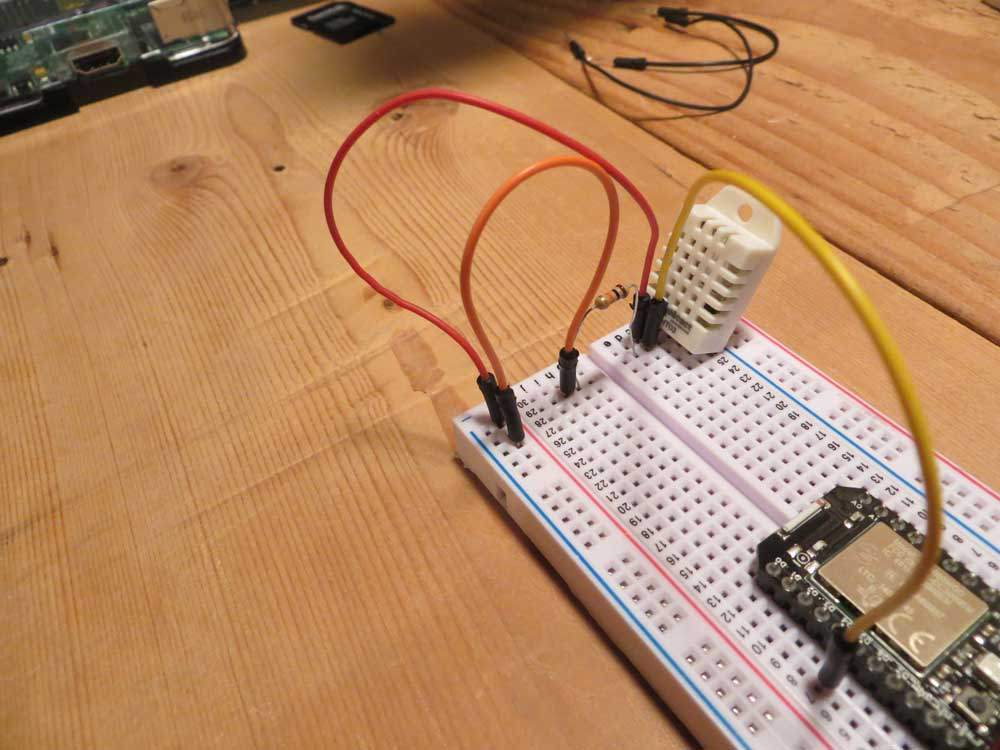
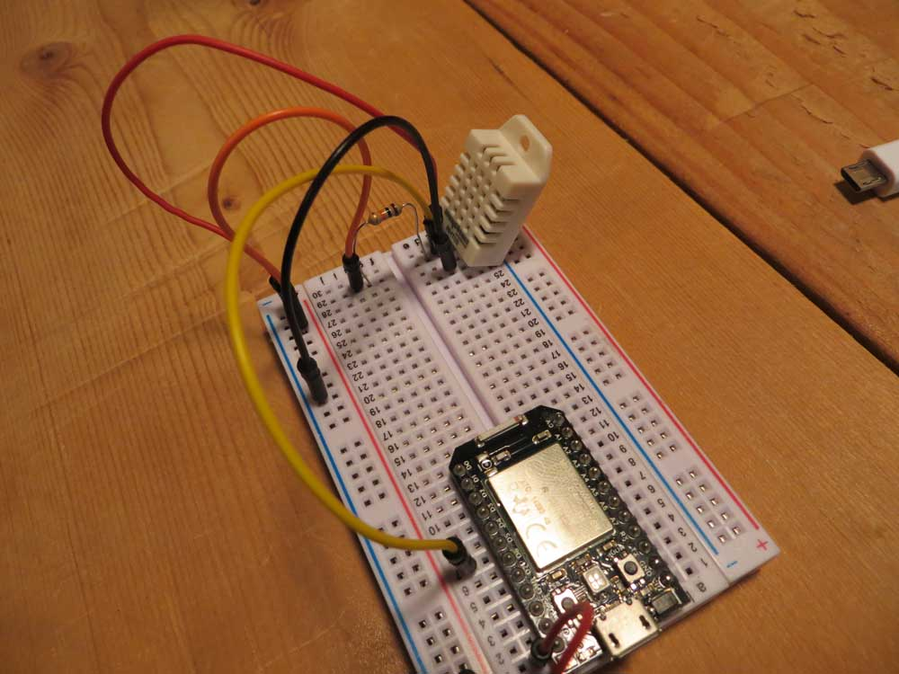
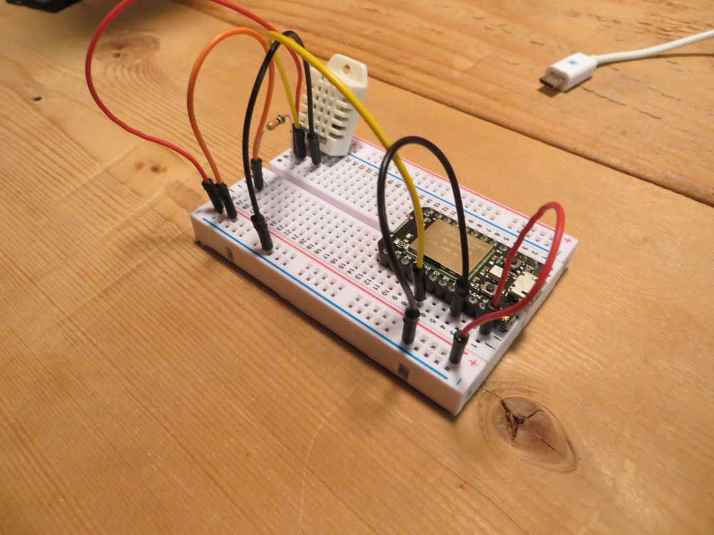
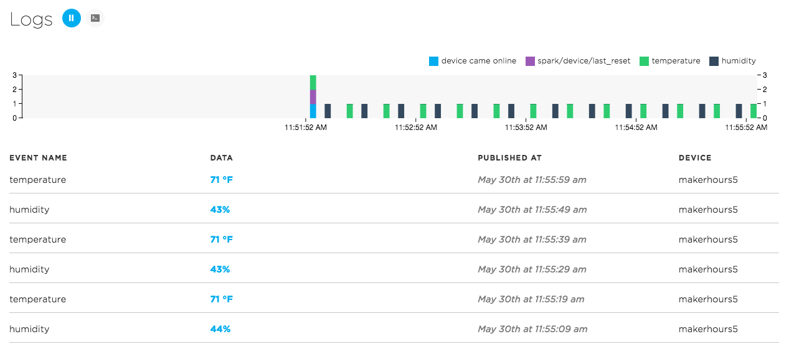

# Checking the temperature

### Our first foray into inputs

The most basic and widespread sensor journalism in the world is the weather. And that starts with temperature. So given that, let's explore taking the temperature of the room you are in right now. 

## Particle

To do this, we'll need to try a few new things. We'll first need to regulate the signal using a resistor -- and explore the concept of "noisy" signals. We'll need to take input -- instead of providing output -- to our board. And we'll need to use the monitor built into the Arduino software to see what the temperature is. 

We need a breadboard, your Particle board, a 1KOhm resistor, red jumper wire, two black jumper wires, a long red jumper wire, a long black jumper wire, a jumper wire of another color and an RHT03 temperature and humidity sensor.


**STEP 1** 

Plug the Particle board into the breadboard straddling the two sides of the breadboard. To give you the most room, you should put it at the top of the breadboard. 




**STEP 2** 

Face the waffle-ly side of RHT03 toward you. Place RHT03 into the bottom corner of the breadboard (which side doesn't matter), with the four pins arrayed with the left most pin on the sensor in the bottom row of the breadbard, second pin in next up and so on. 



**STEP 3**

Take a short red jumper wire and plug it into the leftmost pin near the sensor. Plug the other wire into the positive channel.

Take another red jumper wire and plug one end into the positive channel, the other into the 3V3 pin on the Particle board. There are two. It doesn't matter which you use. 



**STEP 4**

Take a yellow jumper wire and plug it into the secondmost pin, in a spot near to the sensor. Plug the other end of the jumper into pin D5 on the Particle. 

**STEP 5**

Put one end of a 1KOhm resistor into row 2, nearest the center gap between the two sides of the breadboard. Then, put the other side of the resistor into row 2 on the other side of the center divide, creating a sort of bridge. 


**STEP 6**

Place one end of a short jumper wire into the row next to your resistor -- the second row up from the bottom -- on the side of the breadboard opposite of the sensor, and then plug the other end into the positive channel. 



**STEP 7**

Pin 3 on the sensor is blank. We do nothing with it.

**STEP 8**

Pin 4 on the RHT03 is the ground. Take a short black jumper wire and plug it into the broadboard closest to the sensor in the fourth row up from the bottom of the breadboard. Plug the other end of the jumper into the negative channel.




**STEP 9**

Take a long black jumper wire and plug it into the negative channel. Plug the other end into a GND pin on the Arduino board. 




**STEP 10**

Plug in your Particle board to USB. 

Open the [Particle Build IDE](https://build.particle.io). 

Click create new app. Give your app a name (I called my ParticleTemp). 

Copy and paste this code:

```
#include <Adafruit_DHT.h>

#define DHTPIN 5
#define DHTTYPE DHT22

DHT dht(DHTPIN, DHTTYPE);

int temperature;
int humidity;

void setup() {
    
    dht.begin();
}

void loop() {
    
    temperature = dht.getTempFarenheit();
    humidity = dht.getHumidity();    
    Particle.publish("temperature", String(temperature) + " °F");
    Particle.publish("humidity", String(humidity) + "%");
    delay(10000);

}

```

If all has worked well, you should be able to click the latest event indicator at the bottom of the screen to get to the monitor. There, you'll see the following:





**WHY DID THAT WORK**

The Adafruit library made the code for this very, very simple and very easy to read. 

First, we import the Adafruit DHT library and set it up by telling it which pin we're going to read and which sensor we're using (the RHT03 is also known as the DHT22). Then we package that all up into a variable called dht that uses the code in the DHT library with our setup.

```
#include <Adafruit_DHT.h>

#define DHTPIN 5
#define DHTTYPE DHT22

DHT dht(DHTPIN, DHTTYPE);

```

Next we define some variables -- temperature and humidity -- and set their type. 

```
int temperature;
int humidity;

```

Just like any other Arduino-based setup, we call void setup and start the dht sensor.

```
void setup() {
    
    dht.begin();
}
```

Now we loop the code. Adafruit makes this very easy to read. Read the temperature, read the humidity, send it to the Particle console through publish, sleep for 10 seconds. It's really that simple.

```
void loop() {
    
    temperature = dht.getTempFarenheit();
    humidity = dht.getHumidity();    
    Particle.publish("temperature", String(temperature) + " °F");
    Particle.publish("humidity", String(humidity) + "%");
    delay(10000);

}
```