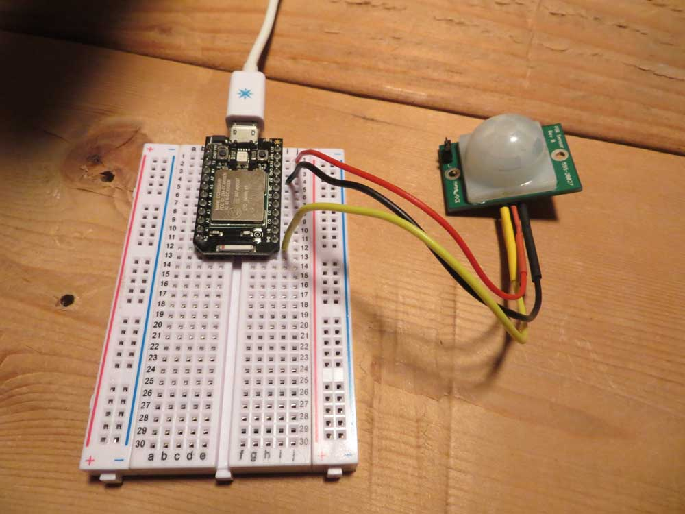
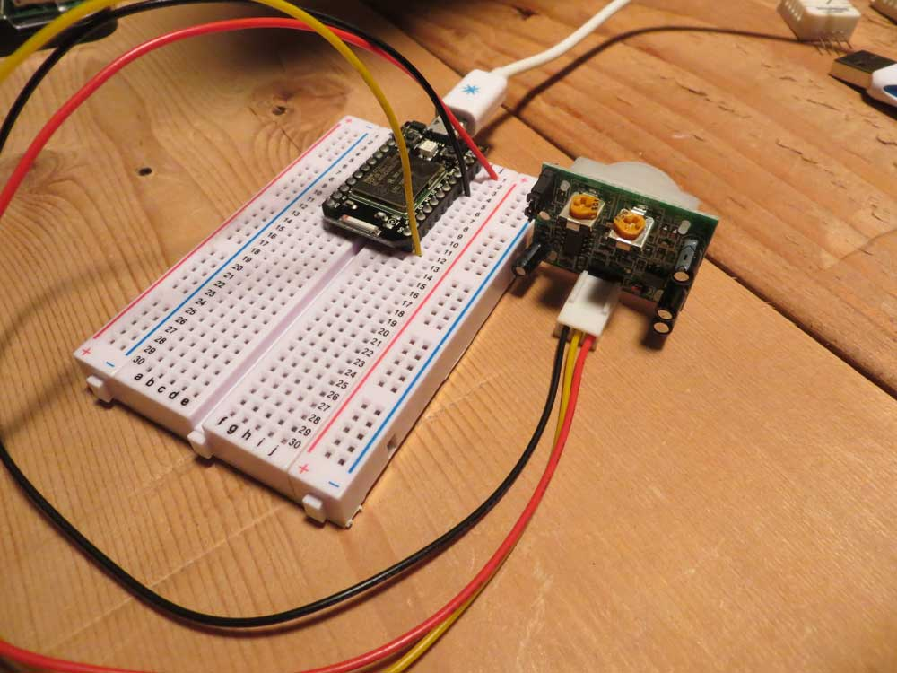

# Detecting motion

### Sensing something visible

Journalism is about people, right? So let's figure out a way to detect a person in the room. 

## Particle

**STEP 1**

Gather your materials. You will need your Particle board, passive infrared sensor, and three jumper wires (red, yellow and black).  

**STEP 2** 

With your Particle pressed into the breadboard so the pins straddle the middle of the board, find a GND (Ground), 3V3 and D0 inputs on the right side of the board. 

Find the VCC, GND and OUT ports on the passive infrared sensor. If they aren't labeled, but you have wires attached, the yellow wire is OUT, VCC is red and GND is black.  
  
**STEP 3** 

How your PIR sensor comes to you -- if you already have wires attached to it or if you just have pins coming from the bottom -- will determine how you connect your PIR to the board. You need to connect GND to GND, VCC to 3V3 and OUT to D0. 

Here's an example of a PIR with jumper wires soldered to the pins:



Here's an example of a PIR with a wiring harness attached. Either way, the connections are simple.



**STEP 4** 

Open your Particle IDE. Plug your Particle into your computer. Verify and upload this code:

```
int pirState = LOW;
int val = 0;

void setup() {
    pinMode(D0, INPUT);
}

void loop(){
  val = digitalRead(D0);  // read input value
  if (val == HIGH) {            // check if the input is HIGH
    if (pirState == LOW) {
      // we have just turned on
      Particle.publish("motion", "MOTION DETECTED");
      // We only want to print on the output change, not state
      pirState = HIGH;
    }
  } else {
    if (pirState == HIGH){
      // we have just turned of
      Particle.publish("motion", "MOTION ENDED");
      // We only want to print on the output change, not state
      pirState = LOW;
    }
  }
}
```
 
**STEP 5** 

If all goes well, when you pass your hand in front of the sensor, the Particle should publish to the log "MOTION DETECTED" to the online monitor.

### Why did this work?

The first code block tells the Particle what kind of input and output to expect from each pin number. The Particle sets the initial/default reading for the PIR sensor to  ```LOW;```. If the sensor picks up infrared activity, its value changes to ```pirState = HIGH;``` and then flicks back to its initial/default of ```pirState = LOW;```. The code also creates a global variable in which to store the input value ```val = 0;```.  

```
int pirState = LOW;
int val = 0;
```

The second code block tells the Arduino what to expect as input and ouput:

```
void setup() {
    pinMode(D0, INPUT);
}
```

We only want to print changes in the state of the PIR sensor. The sensor is set to ```LOW``` initially/as a default. If that goes unchanged, the sensor picks up no infrared activity, the loop goes down to the nested ```else``` loop. 

If that loop senses no change, that the sensor sensed nothing, the whole loop starts over. 

We set the initial (and default) sensor setting to ```LOW```. When something happens, the sensor flicks on to ```HIGH``` and then back to ```LOW```. If the loop picks up a change from the initial ```LOW``` state, if it picks up ```HIGH```, then the loop checks if the sensor has flicked back on to ```LOW```, if so, motion has been detected and we print to the serial monitor. 

```
void loop(){
  val = digitalRead(D0);  // read input value
  if (val == HIGH) {            // check if the input is HIGH
    if (pirState == LOW) {
      // we have just turned on
      Particle.publish("motion", "MOTION DETECTED");
      // We only want to print on the output change, not state
      pirState = HIGH;
    }
  } else {
    if (pirState == HIGH){
      // we have just turned of
      Particle.publish("motion", "MOTION ENDED");
      // We only want to print on the output change, not state
      pirState = LOW;
    }
  }
}
```

We then assign a state of ```HIGH``` to the serial monitor and the loop repeats. We don't want to detect ongoing movement, so the loop repeats and prints nothing as long as nothing causes the new set value of ```HIGH``` to change.

If there is a change, however, and an absence of activity causes the reading to flick over to ```LOW```, the ```ELSE``` loop takes over and reads the change from the new initial/default ```HIGH``` to ```LOW``` and back to ```HIGH```, it prints the change, and sets the default back to ```LOW```.


## STRETCH GOAL: Combine two sensors

What if we just wanted to know what the temperature is when someone walks in the room? We can combine our temperature sensor and our PIR sensor. And we can merge the code. 

The wiring for the PIR is exactly as above. The wiring for the temperature sensor is exactly as in the Particle Temperature lesson. 

Open the Particle IDE and create a new app, called ParticlePIRTemp. Click on libraries and add the Adafruit DHT library. Then copy and paste this code: 

```
#include <Adafruit_DHT.h>

#define DHTPIN 5
#define DHTTYPE DHT22

DHT dht(DHTPIN, DHTTYPE);

int temperature;
int humidity;

int pirState = LOW;
int val = 0;

void setup() {
    pinMode(D0, INPUT);
    dht.begin();
}

void loop() {
  val = digitalRead(D0);  // read input value
  if (val == HIGH) {            // check if the input is HIGH
    if (pirState == LOW) {
      temperature = dht.getTempFarenheit();
      humidity = dht.getHumidity();  
      Particle.publish("motion", "MOTION DETECTED");
      Particle.publish("temperature", String(temperature) + " °F");
      Particle.publish("humidity", String(humidity) + "%");
      pirState = HIGH;
    }
  } else {
    if (pirState == HIGH){
      // we have just turned of
      Particle.publish("motion", "MOTION ENDED");
      // We only want to print on the output change, not state
      pirState = LOW;
    }
  }
}

```

If you look at the code from both lessons, you'll see this code just combines them. The initial states are the same, the setup is creating the input pin mode and starting the dht sensor. The loop just puts the reading of the temperature inside the change in the PIR state. Instead of just publishing that motion has been detected, it senses the temperature and then does the publishing.