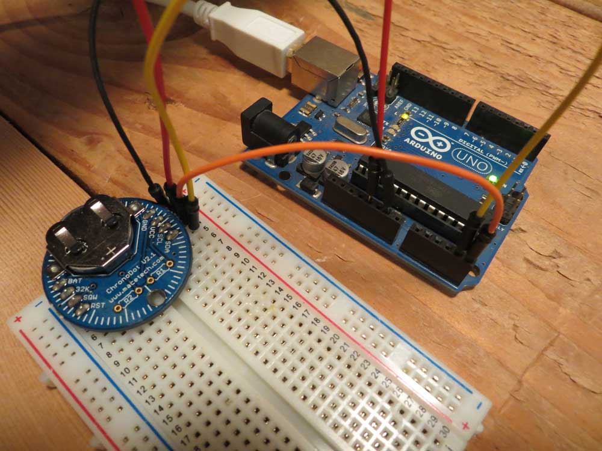

# Telling time

### A key element to sensing: when did it happen

Often, we just want to sense things when the time is right. Most of the time, our devices are not going to be able to tell the time on their own. They'll require something called a Real Time Clock (RTC). We'll use a device called a ChronoDot.   

## Arduino

**STEP 1**

Gather your materials. You will need your Arduino, a ChronoDot and four jumper wires: orange, yellow, red and black.  

**STEP 2** 

The wiring for the ChronoDot is quite simple. On the right side (if the battery opening is to the top of the device), there are four pins: GND, VCC, SCL and SDA.
 
* Black wire from GND on the ChronoDot to GND on the Arduino.
* Red wire from VCC on the ChronoDot to 5V on the Arduino.
* Orange wire from SCL to Analog port 5 (A5) on the Arduino.
* Yellow wire from SDA to Analog port 4 (A4) on the Arduino.

Unlike other sensors, the ports really matter here because the ChronoDot is an IC2/TWI interface, which means SDA is always going to be A4 on the Arduino Uno and SCL is A5.  


  
**STEP 3** 

To run the code, you need to add a library to the available libraries you have in your IDE. [You can get Adafruit's RTC library here](https://github.com/adafruit/RTClib). Click the Clone or Download button, download the file, expand it, rename it to RTClib and move it to your Arduino/libraries folder. You will have to restart your IDE to see the library appear. 

**STEP 4** 

Here is the code. [It is mostly based on this tutorial](http://www.instructables.com/id/Arduino-Aquaponics-Real-Time-Clock-Part-I/). We'll go over it in a second:

```
#include <Wire.h>
#include "RTClib.h"

RTC_DS1307 RTC;

void setup() {
  Serial.begin(9600);
  Wire.begin();
  RTC.begin();
 
  // If the RTC isn't running, then tell us.
  if (! RTC.isrunning()) {
    Serial.println("RTC is NOT running");
  }

  // Grab what time the RTC thinks is right now.
  DateTime now = RTC.now();
  // Now grab the date and time that the compiler has from your computer.
  DateTime compiled = DateTime(__DATE__, __TIME__);
  // if the RTC clock is behind the compiler, set the time on the 
  // RTC to the compiler time. This assumes your computer has the
  // right time.
  
  if (now.unixtime() < compiled.unixtime()) {
    Serial.println("RTC is older than compile time! Updating");
    RTC.adjust(DateTime(__DATE__, __TIME__));
  }
 
  Serial.println("Setup complete.");
}

void loop() {
  // Get the current time
  DateTime now = RTC.now();   
 
  // Display the current time by grabbing each piece and printing it
  Serial.print("Current time: ");
  Serial.print(now.month(), DEC);
  Serial.print('/');
  Serial.print(now.day(), DEC);
  Serial.print('/');
  Serial.print(now.year(), DEC);
  Serial.print(' ');
  Serial.print(now.hour(), DEC);
  Serial.print(':');
  Serial.print(now.minute(), DEC);
  Serial.print(':');
  Serial.print(now.second(), DEC);
  Serial.println();
 
  delay(10000);
} 
```

So this requires a little more setup, because it uses a different interface than other sensors we've used before. If you want to know more about IC2/TWI, [you can get more here](https://www.arduino.cc/en/reference/wire). So the setup does three things initially: Starts reading the serial data, starts up the wire library and it's reading capabilities, and starts up the real time clock. Then it checks if the clock is running. After that, it synchronizes the time from when you compiled the code and the time on the Chronodot. If this is the first time you're running the Chronodot, this code will make it so you don't have to manually set it, which is nice. 

The second part is pretty simple, if a little code inefficient. It grabs each piece of the date and time and prints them with the / and : bits wedged in there to make the formatting nice and easy. 

Verify your code, run it and open the serial monitor. If all has worked, you should see something like this: 

```
Current time: 5/18/2017 18:49:30
Current time: 5/18/2017 18:49:40
Current time: 5/18/2017 18:49:50
Current time: 5/18/2017 18:50:0
Current time: 5/18/2017 18:50:10
Current time: 5/18/2017 18:50:20
Current time: 5/18/2017 18:50:30
```

### Why did this work? 

There's not a lot of mystery here. The major step is actually in the setup making sure the time on the RTC is the same as the compiler. The rest is just grabbing the time from the RTC. Because it's an IC2/TWI interface, the data comes from the SCL and SDA pins. The SCL is the literally the clock pin, SDA is data. 

