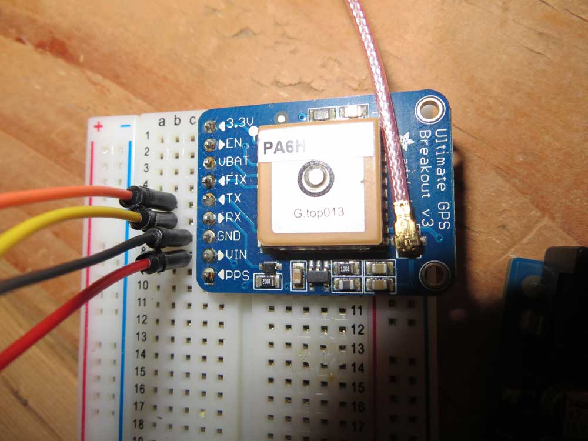
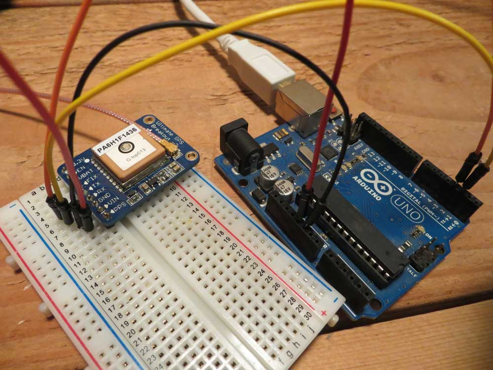
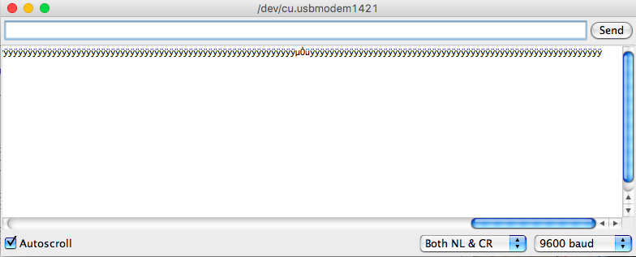
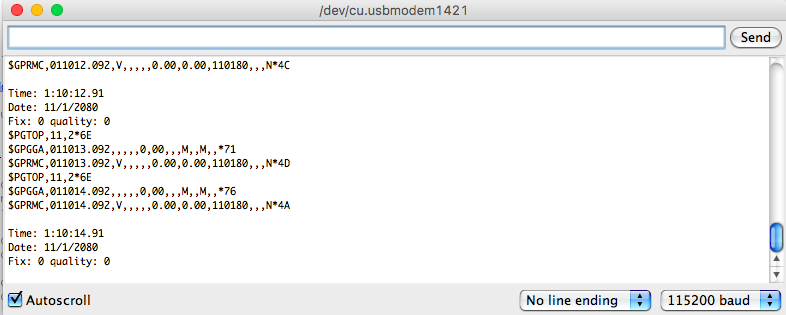
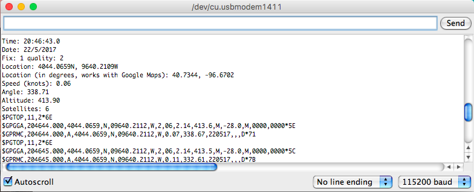

# Detecting location

### The GPS system is a modern marvel: Let's use it.

One of the key pieces of data we can have for any physical phenomenon is where did it happen. 

## Arduino

**STEP 1**

Gather your materials. You will need your Arduino, the Ulimate GPS Breakout, a u.FL connector and antenna and four jumper wires: red and black for power, orange and yellow for data.

**NOTE**: GPS signals are weak. If you're doing this in an interior room, you're unlikely to get a signal. Putting your antenna near a window or taking your project outside may be the only way get data on this one.   

**STEP 2** 

Wiring is relatively simple. There's only four wires, two of them are power. 

* Connect a red jumper wire from the VIN pin on the GPS breakout to the 5V pin on the Arduino. 
* Connect a black jumper wire from the GND pin to a GND pin on the Arduino. 
* Connect an orange jumper from the TX pin on the GPS breakout to  Digital Pin 3 (D3) on the Arduino.
* Connect a yellow jumper from the RX pin on the GPS breakout to Digital Pin 2 (D2) on the Arduino.

  
**STEP 3** 

To run the code, you need to add a library to the available libraries you have in your IDE. [You can get Adafruit's GPS library here](https://github.com/adafruit/Adafruit_GPS). Click the Clone or Download button, download the file, expand it, rename it to Adafruit_GPS and move it to your Arduino/libraries folder. You will have to restart your IDE to see the library appear. 

**STEP 4** 

Up to this point, we've been dealing with sensors with a minimum of data coming at you. It might be coming every few miliseconds, but it's just one number. The GPS breakout sends a LOT of data. Don't believe me? Let's run one of Adafruit's examples and see. 

In your Arduino IDE, go to File > Examples > Adafruit_GPS > parsing

The code is *extensively* commented, so we won't go over it here. But there's two things you have to know in order to see things working correctly. 

First, if you don't have the baud rate set correctly, you'll get gibberish, like this: 

You set the baud rate on the bottom right. Set it to 115200 baud. 

Second issue, is if you aren't getting satellites -- like if you are inside -- then it will look like this:

The giveaway is the line that says Fix: 0 quality 0. That means you have no satellite fixes, so the quality of the fix is zero. 

If you do venture outside, and you've got your antenna set up correctly, you'll see something like this:

### Why did this work? 

The wiring in this case is simple -- you're using TX to send data TO the sensor and RX to receive data FROM the sensor. What isn't so simple is the code. The GPS chip receives a LOT of data, so the code written by Adafruit is pretty verbose. It does a lot of stuff we don't really need it to do. So what if we wanted to just cut it down to the minimum -- what if we just wanted to see the latitude and longitude in decimal degress? How do we do that? 

## STRETCH GOAL:

Simplify the code.  

