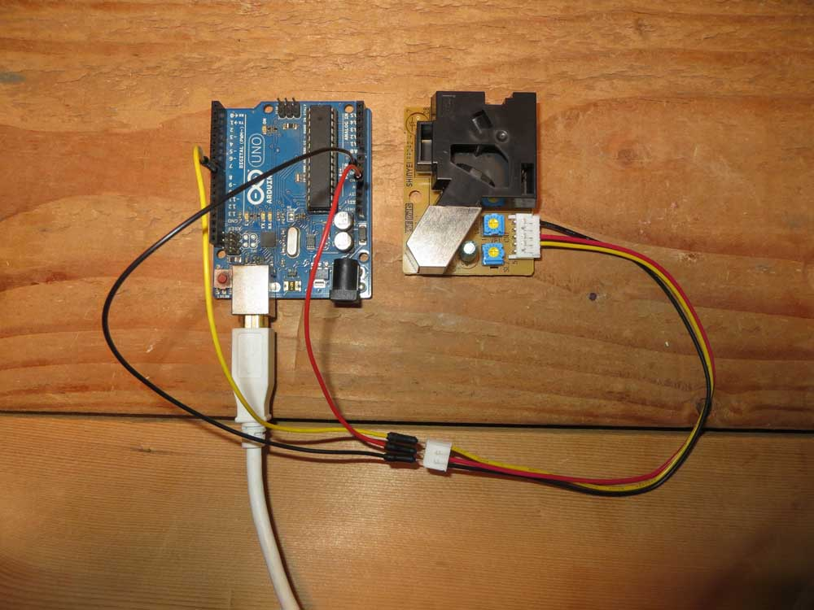
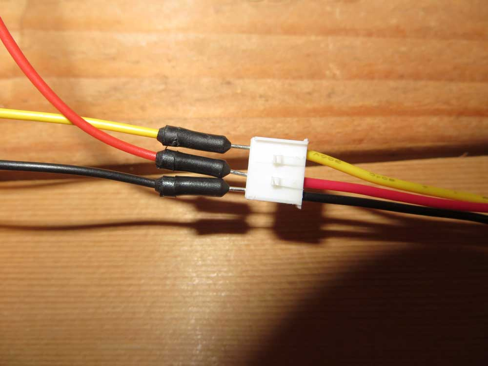
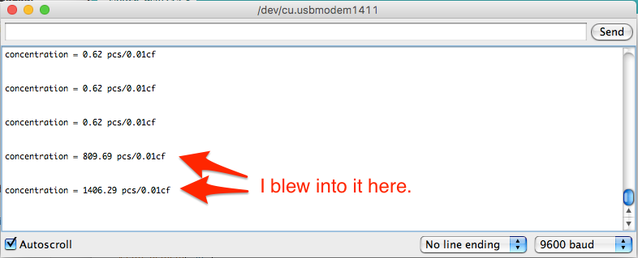

# How good is the air you breathe?

### Air quality is complex. Let's start simple.

When we start getting into more scientific areas like air quality or water quality, things start getting more difficult. Issues of sensor quality, sensitivity and just what exactly is being measured become front-and-center issues you have to deal with. Often, the first question you have to deal with is this: Is there a sensor that will even tell me what I want to know? For water quality, many of the issues you'd want to track require chemical tests done in a lab to work. With air quality, there's mulitple measures that combine. 

One of the easiest is particulates. How much dust and stuff is in the air? 

## Arduino

**STEP 1**

Gather your materials. You will need your Arduino, the Grove Dust Sensor, and three jumper wires: red and black for power, yellow for data.

**STEP 2** 

Wiring is relatively simple. There's only three wires, and the wiring harness that comes with the Dust Sensor makes it pretty clear what is what. 

* Connect a red jumper wire from the red pin on the connector on the wiring harness to the 5V pin on the Arduino. 
* Connect a black jumper wire from the black wire on the wiring harness to a GND pin on the Arduino. 
* Connect a yellow jumper from the yellow wire on the wiring harness to Digital Pin 8 (D8) on the Arduino.




  
**STEP 3** 

Seeed Studios provides an [in-depth walkthrough of the Grove Dust Sensor on their wiki](http://wiki.seeed.cc/Grove-Dust_Sensor/). You can get more info there. Here's the code they provide to make it work. Put it into a blank Arduino sketch, verify it and upload it. 

```
/*
Grove - Dust Sensor Demo v1.0
 Interface to Shinyei Model PPD42NS Particle Sensor
 Program by Christopher Nafis
 Written April 2012

 http://www.seeedstudio.com/depot/grove-dust-sensor-p-1050.html
 http://www.sca-shinyei.com/pdf/PPD42NS.pdf

 JST Pin 1 (Black Wire)  => Arduino GND
 JST Pin 3 (Red wire)    => Arduino 5VDC
 JST Pin 4 (Yellow wire) => Arduino Digital Pin 8
 */

int pin = 8;
unsigned long duration;
unsigned long starttime;
unsigned long sampletime_ms = 30000; // sample 30s
unsigned long lowpulseoccupancy = 0;
float ratio = 0;
float concentration = 0;

void setup() {
  Serial.begin(9600);
  pinMode(8,INPUT);
  starttime = millis(); // get the current time;
}

void loop() {
  duration = pulseIn(pin, LOW);
  lowpulseoccupancy = lowpulseoccupancy+duration;

  if ((millis()-starttime) >= sampletime_ms) // if the sample time == 30s
  {
    ratio = lowpulseoccupancy/(sampletime_ms*10.0);  // Integer percentage 0 => 100
    concentration = 1.1*pow(ratio,3)-3.8*pow(ratio,2)+520*ratio+0.62; // using spec sheet curve
    Serial.print("concentration = ");
    Serial.print(concentration);
    Serial.println(" pcs/0.01cf");
    Serial.println("\n");
    lowpulseoccupancy = 0;
    starttime = millis();
  }
}

```
 
**STEP 4** 

Pull up the serial monitor and you'll see, every 30 seconds, a new reading comes in. You'll note that the most common reading is .62 pcs/0.01cf -- that's essentially zero. If you blow into it, you'll get some big numbers. And if you leave it run for a while, you'll get some spiky numbers, depending on your environment. My workshop in my house, where I made this tutorial, isn't exactly the cleanest place in the house, so it can be dusty. 




### Why did this work? 
 
If you look at the code, most of it is defining a series of variables that will get overwritten in the loop. The setup is pretty plain -- the only thing you won't see in every other tutorial on Arduino stuff is the getting of the time in milliseconds. 

In the loop, the most important part is the concentration -- that's the part that has physical meaning. The variable is a formula based on the sensor's capabilities and the curve of the graph representing those capabilities. So the formula calculates how much dust is in the room based on the sensor's value (which is represented by `ratio` in the formula) and a set of constants.